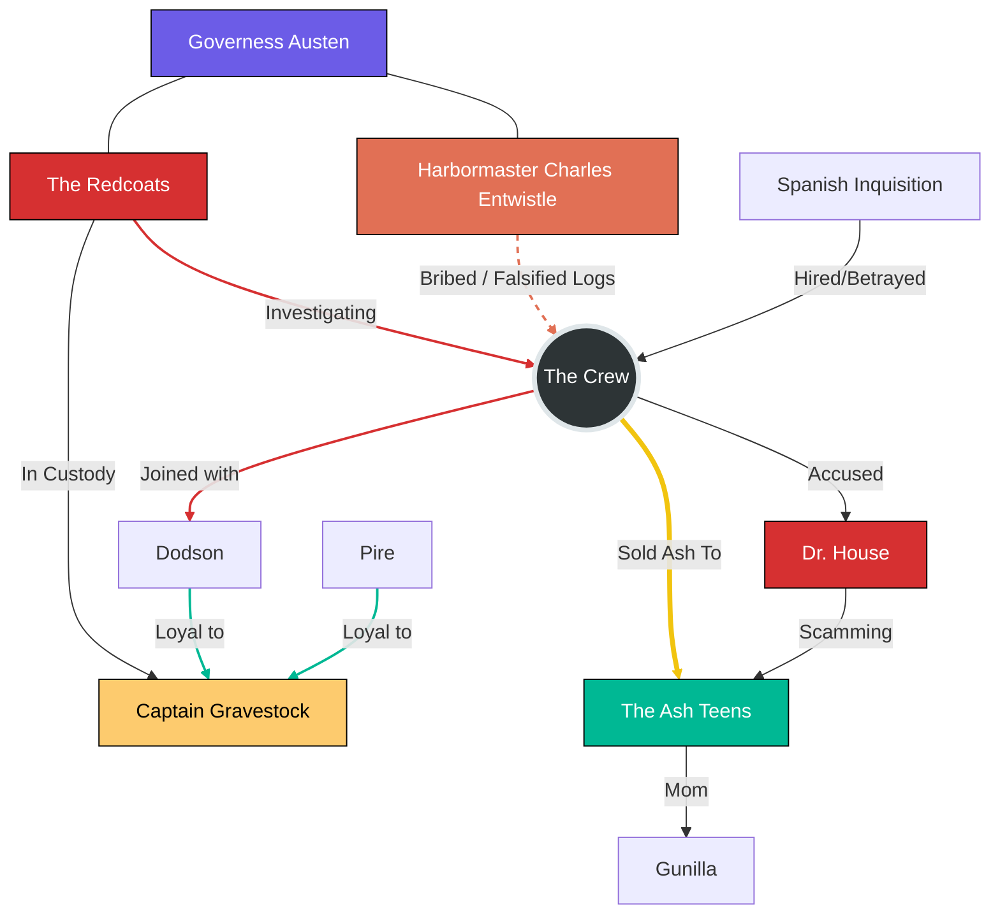

# Relationship Map

```mermaid
graph TD
    %% Global Hierarchy
    GA[Governess Austen] --- RC[The Redcoats]
    
    GA --- HM[Harbormaster Charles Entwistle]

    %% Authority & Control
    RC -- "Investigating" --> PC
    RC -- "In Custody" --> Capt[Captain Gravestock]
    HM -. "Bribed / Falsified Logs" .-> PC

    %% The Crew & Allies
    PC((The Crew))
    SI[Spanish Inquisition] -- Hired/Betrayed --> PC
    PC -- "Joined with" --> Dodson[Dodson]
    
    Dodson -- "Loyal to" --> Capt
    Pire -- "Loyal to" --> Capt

    %% The Ash Trade & Conflict
    PC == "Sold Ash To" ==> Teens[The Ash Teens]
    Teens -- Mom --> Gunilla[Gunilla]
    House[Dr. House] -- "Scamming" --> Teens
    
    PC -- "Accused" --> House
    
    %% Teens
    

    %% Node Styles
    style PC fill:#2d3436,stroke:#dfe6e9,color:#fff,stroke-width:4px
    style GA fill:#6c5ce7,stroke:#000,color:#fff
    style RC fill:#d63031,stroke:#000,color:#fff
    style House fill:#d63031,stroke:#000,color:#fff
    style Teens fill:#00b894,stroke:#000,color:#fff
    style Capt fill:#fdcb6e,stroke:#000,color:#000
    style HM fill:#e17055,stroke:#000,color:#fff

    %% Link Styles (Standardized for compatibility)
    linkStyle 2 stroke:#d63031,stroke-width:2px
    linkStyle 6 stroke:#d63031,stroke-width:2px
    linkStyle 4 stroke:#e17055,stroke-width:2px,stroke-dasharray: 5 5
    linkStyle 7 stroke:#00b894,stroke-width:2px
    linkStyle 8 stroke:#00b894,stroke-width:2px
    linkStyle 9 stroke:#f1c40f,stroke-width:4px
```
