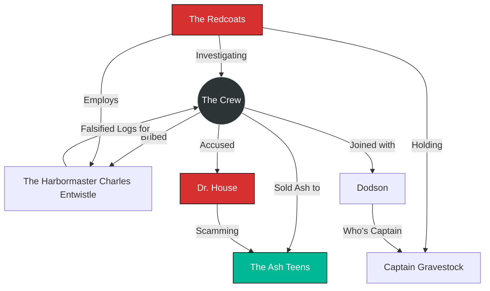

# Relationship Map

```mermaid
graph TD
    %% The Crew
    PC((The Crew)) -- "Sold Ash to" --> Teens[The Ash Teens]
    PC -- "Bribed" --> HM[The Harbormaster Charles Entwistle]
    PC -- "Accused" --> House[Dr. House]
    PC -- "Joined with" --> Dodson[Dodson]
    
    %% Connections
    House -- "Scamming" --> Teens
    HM -- "Falsified Logs for" --> PC
    RC[The Redcoats] -- "Investigating" --> PC
    RC -- "Holding" --> Capt[Captain Gravestock]
    RC -- "Employs" --> HM
    
    Dodson -- "Who's Captain" --> Capt[Captain Gravestock]
    
    %% Styles
    style PC fill:#2d3436,stroke:#dfe6e9,color:#fff
    style House fill:#d63031,stroke:#000,color:#fff
    style RC fill:#d63031,stroke:#000,color:#fff
    style Teens fill:#00b894,stroke:#000,color:#fff
```
